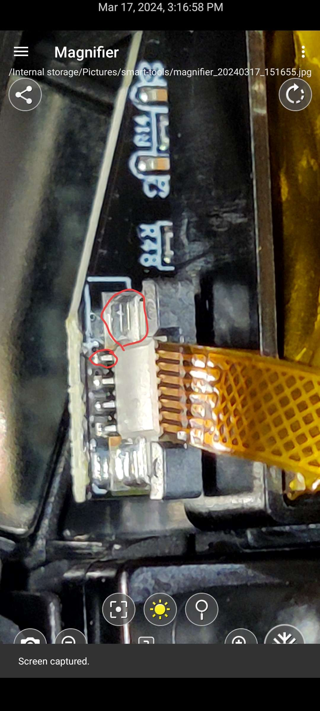

## Documentation for which Antenna Cable inside the GO does what.

White and Black cables are Wifi. Gray is Bluetooth.

The Top empty connector is actually really just a free connector.

credit to @n1GHT on discord

## FPS mode pin.

> So you can completely remove the board and cable if you short the two red points together the larger one is ground the next one is the pin that represents the FPS switch if you connect that PIN to ground it's the same as putting it in gamepad mode.

Credit to @rahlquist on discord

