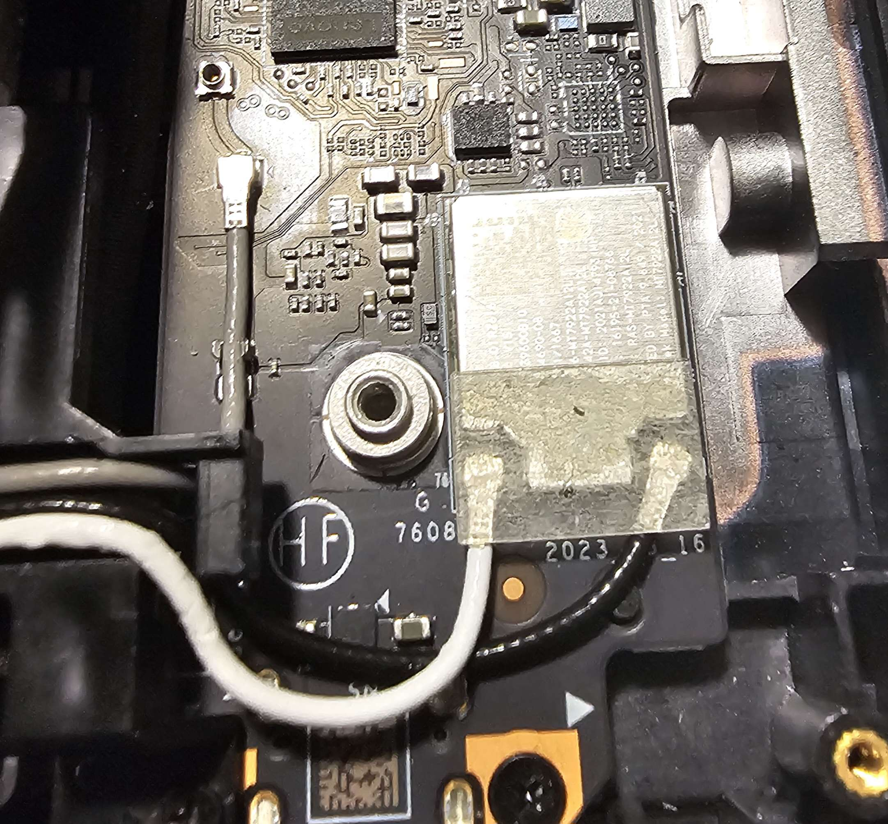

Documentation for which Antenna Cable inside the GO does what. Thanks @n1GHT on discord

White and Black cables are Wifi. Gray is Bluetooth.

The Top empty connector is actually really just a free connector.

